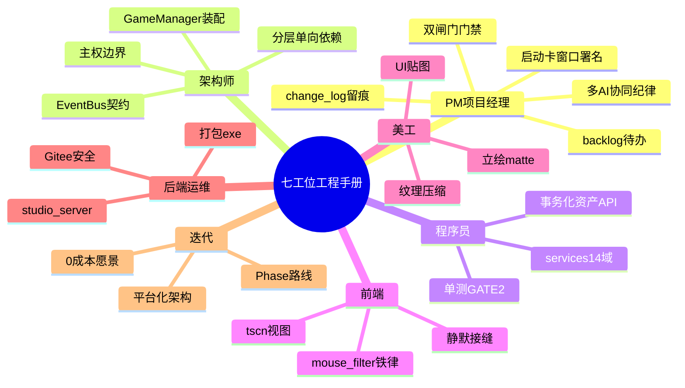
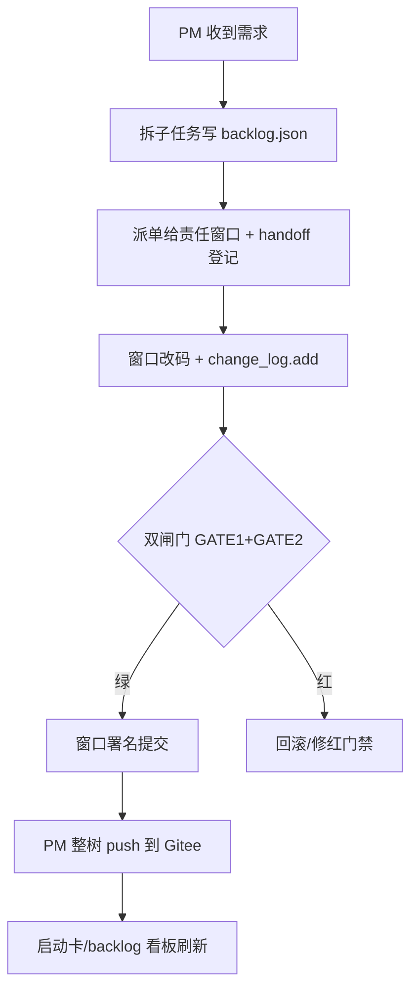
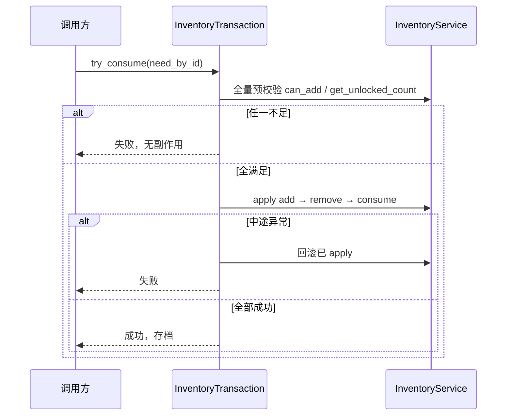
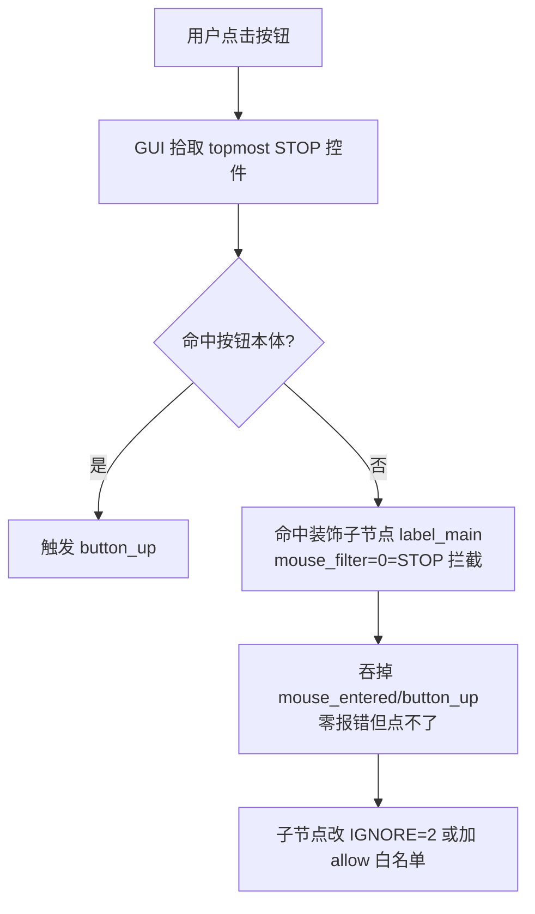
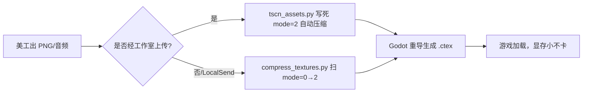
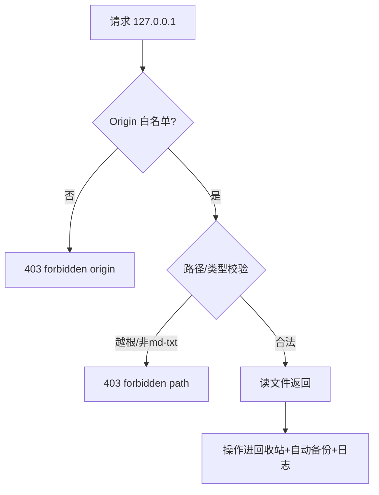

# 武侠江湖 · 全角色工程手册与平台优化蓝图（白皮书续篇）

> 本文是《项目经验白皮书》的**续篇**（对应白皮书第九~十一章）。
> 定位：把白皮书里「架构 / 模块 / BUG / 评价」的静态梳理，转成**每个工位都能照着干活**的工程手册，并对照**当前工作室平台**给出迭代优化方向，目标是让美工 / 程序 / 架构 / 前端 / 后端运维各工位无限趋近「0 成本」推到本职功能。
>
> 阅读前提：先读白皮书第一~八章 + `docs/工作室平台化架构方案.md`。本文所有事实均来自本工程真实源码与已登记 changelog，零臆造。

---

## 第九章 · 全角色工程手册

把「做一个武侠 RPG」拆解到**七个工位**：项目经理(PM) / 架构师 / 程序员 / 前端 / 美工 / 后端运维 / 后续迭代。每个工位给四样东西：

1. **职责边界**（在本工程里具体管什么、不碰什么）
2. **功能实现拆解**（交付物清单）
3. **子模块实现拆解**（落到哪个真实文件 / 服务）
4. **实现路径 + 思路图**（mermaid）+ 踩坑 + 0 成本目标



### 9.1 项目经理（PM）—— 让多 AI 不互踩、不丢活

**职责边界（管）**：派单 / 进度 / 留痕 / 门禁节奏 / 回滚首响。**不碰**：任何 `.gd` 游戏逻辑、任何 `preset_*.json` 数值、任何美术资源。

**功能实现拆解**
| 功能 | 子模块（真实文件） | 实现路径 |
|---|---|---|
| 变更留痕 | `tools/change_log.py` | 每次改完 `add` 一行；`query` 调试前先查 |
| 待办清单 | `docs/backlog.json` + `tools/gen_backlog.py` | 只改 json，重跑生成 md/HTML 看板 |
| 协同启动卡 | `docs/AI协同启动卡.md` | 开窗口粘口令=git 署名，点火开关 |
| 双闸门门禁 | GATE1(headless) + GATE2(run_all) | 提交前必跑，非绿即阻断 |
| 隐患传递板 | `tools/handoff.py` | 跨窗口派单/认领/交接 |

**思路图（派单→落地→门禁闭环）**


**踩坑**：① 某窗改了小问题另一窗修半天——根因看不到别人改了啥，靠 `change_log.query` 解决；② 红门禁=别人改崩（如 `BattleScene` 缩进错 Parse Error 致战斗测试长期红），须立即修；③ 匿名提交没法追溯 → 强制 `git config user.name "AI-<窗>"`。
**0 成本目标**：工作室「待办清单」「协同启动卡」标签页已落地，PM 打开网页即纵览全局，无需翻聊天记录。

### 9.2 架构师 —— 定铁律、守接缝

**职责边界（管）**：分层 / 依赖方向 / 装配 / 信号契约 / 主权边界。**不碰**：具体业务逻辑实现（交给程序）、数值（交给战斗/经济窗口）。

**功能实现拆解**
| 功能 | 子模块 | 实现路径 |
|---|---|---|
| 分层单向依赖 | `autoload→core→data→services→scenes→resources` | 四底线：单向依赖 / 跨模块只走 EventBus / 数值全进 JSON / 命名见名知意 |
| 装配中枢 | `core/game_manager.gd` | 24 管理器依赖注入容器，`_ready` 装配 |
| 信号契约 | `core/event_bus.gd` | NOTIFY（广播状态）/ CMD（请求动作）两类，97 条接缝 |
| 主权边界 | `docs/多AI协同机制_SOP.md` | 共享地基冻结，UI/战斗/背包/结缘各有主权 |

**思路图（数据流单向 + 接缝唯一）**
```mermaid
flowchart LR
    S[services 业务域] -->|emit NOTIFY| E[EventBus]
    E -->|订阅刷新| U[scenes/ui]
    U -->|emit CMD| E
    E -->|调用| S
    GM[GameManager 装配] -.注入.-> S
    GM -.注入.-> U
    note right of E: 跨模块唯一通道<br/>禁互相直接调用
```

**踩坑**：① `mouse_filter` 枚举反直觉 STOP=0 不是忽略，装饰子节点必须写 IGNORE(2)；② 延迟切场景 `await process_frame` 后尾行绝不能递归调自身（递归自转静默吞功能）；③ 关系双写脏档——单一真源治理。
**0 成本目标**：`docs/契约总表.md` + `test_eventbus.gd` 自动守住信号契约，新 AI 改接口先过门禁。

### 9.3 程序员 —— 写服务、锁事务、补单测

**职责边界（管）**：14 个 services 业务域逻辑、RefCounted 内核、事务化资产 API、单测。**不碰**：`.tscn` 视图布局（前端）、美术资源（美工）。

**功能实现拆解（以经济 / 结缘为例，据实）**
| 业务域 | 真实文件 | 核心模式 |
|---|---|---|
| 背包/库存 | `services/inventory/inventory_service.gd`(778) | 事务化资产 API |
| 事务内核 | `services/inventory/inventory_transaction.gd`(83) | 预校验→apply→回滚 |
| 商店 | `services/shop/shop_service.gd`(145) | 售卖锁 `get_unlocked_count` 防 BUG-04 |
| 锻造/炼药 | `forge_service.gd`(106)/`alchemy_service.gd`(43) | 产出 `can_add` 预检防扣料丢产出 |
| 好感 | `services/bond/bond_service.gd`(267) | 好感单一真源 |
| 姻缘 | `services/bond/romance_service.gd`(536) | 配偶名单单一真源 + 事务扣聘礼 |
| 关系网 | `services/bond/relationship_service.gd`(226) | 纯聚合门面，无状态不进存档 |

**实现路径（事务化资产 API，防「扣钱不发货 / 扣料丢产出」）**


**踩坑**：① BUG-04 售卖锁定物白赚银两（返回值忽略）→ 改 `get_unlocked_count`；② BUG-03 关系双写脏档 → 删 `bond_service` 重复字典全走专用服务；③ BUG-10 聘礼判定分叉 → `can_propose`/`propose` 共用 `_dowry_satisfied`；④ 实例 ID `_next_iid` 随存档恢复；⑤ `save` 必须 `duplicate(true)` 深拷贝。
**0 成本目标**：`test_eventbus.gd` + `test_shop_service.gd` + 7 个服务单测已守住核心接缝，改服务先过 GATE2。

### 9.4 前端 —— 画 tscn、守 mouse_filter、接静默接缝

**职责边界（管）**：`scenes/ui/**` 的 `.tscn` 视图、节点树、信号连接、本地化文本。**不碰**：services 逻辑、美术源文件。

**功能实现拆解**
| 功能 | 子模块 | 实现路径 |
|---|---|---|
| 界面布局 | `scenes/ui/screens.json`(21 项全 .tscn) | 全量 .tscn 化，工作室可传贴图 |
| 静默拦截守卫 | `tools/lint_mouse_filter.py`(GATE0) | 扫按钮下装饰子节点 mouse_filter=STOP(0) |
| 接缝集成测试 | `tests/unit/test_ui_mouse_filter.gd`(GATE2) | instantiate 后断言子节点不得 STOP |
| 本地化 | `data/configs/localization/*` | 文本抽 json，不硬编码 |

**思路图（一个按钮为什么点不了）**


**踩坑**：① `WuxiaMenuButton` 子节点误写 0(=STOP) 盖住按钮中心 → 登录界面卡死零报错（真凶）；② headless/单测抓不到静默拦截，必须用鼠标拾取模拟器；③ 见 `.tscn` 里 `mouse_filter = 0` 在装饰节点上先怀疑写反。
**0 成本目标**：工作室「UI 贴图」标签页 + GATE0 静态守卫，前端传图/改布局后提交自动过静默拦截扫描。

### 9.5 美工 —— 出图、压缩、传工作室

**职责边界（管）**：立绘(matte/half_body)、UI 贴图、背景、战斗底图、音频。**不碰**：`.gd` 逻辑、`.tscn` 节点（只提供图，前端接）。

**功能实现拆解**
| 功能 | 子模块 | 实现路径 |
|---|---|---|
| 立绘动画 | `matte_*`(124 帧序列)/`half_body` | AnimatedSprite2D 循环 |
| 纹理压缩 | `tools/compress_textures.py` + `tscn_assets.py` | mode=2 双保险，显存小加载快 |
| UI 贴图上传 | 工作室 `/api/ui_slot/upload` | 直写 .tscn，不写 uid |
| 背景/战斗底图 | `/api/login/bg` `/api/battle_bg/upload` | 工作室插件改登录/战斗背景 |

**思路图（美术资源从出图到上游戏）**


**踩坑**：① 把纹理改压缩后 `get_pixel()` 在压缩图上刷屏 9024 条 ERROR 拖死主线程（卡死真因）→ 取像素改用 `Image.load_png_from_buffer` 解码源；② `preset_12x12.jpg` 实为 PNG 错命名 → 改名 .png 改 JSON 引用；③ `Image.load_from_file` 在 4.7.2 非实例方法会 Parse Error；④ 音频新资源必须 `editor --quit` 重导生成 `.import`，否则 `play` 静默跳过。
**0 成本目标**：工作室登录/战斗/UI 贴图插件 + 压缩双保险，美工传图即自动压缩上线，不用懂 Godot 导入。

### 9.6 后端运维 —— 养工作室、打包、保安全

**职责边界（管）**：`tools/desktop_studio/` 服务端、PyInstaller 打包、Gitee 备份、安全自检、双闸门 CI。**不碰**：游戏业务。

**功能实现拆解**
| 功能 | 子模块 | 实现路径 |
|---|---|---|
| 本地 Web 服务 | `studio_server.py`(550) + `studio_core.py` | 标准库，端口自动顺延 |
| 经验库面板 | `/api/experience` + `/api/experience/doc` | 路径穿越防护 + 仅 md/txt |
| 打包 exe | `工作室专业调教.spec` + PyInstaller | `--clean`，datas 含 index.html |
| 安全自检 | `security_selftest.py`(15 断言) | 127.0.0.1 绑定 / 白名单 / ZIP 校验 / Origin 防护 |
| Gitee 备份 | `git push origin master` | origin 私人仓库，.gitignore 排缓存 |

**思路图（工作室安全红线）**


**踩坑**：① 端口 8765 旧进程堆积 → 新 exe 起不来/404，须 `Stop-Process` 清干净；② PyInstaller 的 `os.remove` 被 safe-delete shim 拦 → `CODEBUDDY_SAFE_DELETE_ENABLED=0`；③ onefile 后 `__file__` 指向临时目录，datas 必须含数据文件否则端点 404；④ 令牌别写进 git config，推送用临时 URL。
**0 成本目标**：`--clean` 重打包 + 6 副本 md5 同步 + 安全自检一键跑，运维更新零手抖。

### 9.7 后续迭代 —— 平台化、换皮零成本

**职责边界（管）**：Phase 路线、平台化架构、适配器、跨项目复用。**不碰**：单游戏实现细节。

**功能实现拆解**
| 功能 | 子模块 | 实现路径 |
|---|---|---|
| 二维解耦 | `docs/工作室平台化架构方案.md` | Domain Module × Project Adapter |
| 工程适配器 | `projects/wuxia_game.yaml`(manifest) | 数据路径/格式/可用模块/校验 |
| 模块注册中心 | `modules/__init__.py` | 5 Domain + RBAC 角色过滤 |
| 经验库 | `/api/experience` + `docs/经验库/` | AI 上下文 + 换皮 + 经验复用 |

**思路图（换皮零成本 = 适配器换配置）**
```mermaid
flowchart LR
    Platform[平台能力 UI/剧情/战斗/资产/治理] -->|manifest 驱动| Adapter[Project Adapter]
    Adapter -->|数据路径/格式| GameA[武侠游戏]
    Adapter -->|换一份 yaml| GameB[新游戏]
    note right of Adapter: 代码不动<br/>只换 manifest + 资源
```

**踩坑**：① 平台=连接器不是容器，不持有工程数据；② 远程访问紧迫度极低，已决策延后；③ 模块物理迁移须分 Phase 渐进，不推翻现有代码。
**0 成本目标**：`reskin` 能力 = 换皮只换 `manifest.yaml` + 资源目录，业务逻辑零改动。

---

## 第十章 · 复盘总览（优缺点 / 可复用 / 隐患 / 跨项目 / 小白成长）

### 10.1 优点与亮点（值得复用）
- **分层单向依赖 + 装配中枢**：24 管理器在 `GameManager` 注入，依赖方向零环，新人读得懂。
- **EventBus NOTIFY/CMD 双类契约**：跨模块唯一通道，97 条接缝可机器校验（`test_eventbus.gd`）。
- **事务化资产 API**：经济/背包「扣钱必发货、扣料必出产出」锁死，根治 P0 资产丢失类 BUG。
- **单一真源 + 纯聚合门面**：结缘系统根绝双写脏档（BUG-03）。
- **双闸门门禁**：GATE1(零错误) + GATE2(零✗) 非绿即阻断，给了「敢改」的底气。
- **多 AI 协同纪律**：change_log + 启动卡署名 + handoff 传递板 + pre-commit 机器兜底。

### 10.2 缺点与诚实差距（对比大厂）
- **无正式 CI/CD**：双闸门靠人工/脚本跑，未接 GitHub Actions / Gitee CI 自动门禁。
- **测试覆盖不均衡**：quest/ability/alchemy/forge/sect 单测晚补，业务断档曾最严重。
- **无类型化存档契约**：存档 JSON 靠手对字段，SaveManager 回退测试暴露了脆弱性。
- **本地化/数值散落**：部分数值仍硬编码在 `.gd`（已知 BUG-16/17/18 非阻塞待办）。
- **平台鉴权弱**：当前 super_admin 默认全量，RBAC 仅 Phase 1a 骨架，远程前必须叠鉴权。

### 10.3 可复用性（给平台 / 新项目）
| 复用项 | 形式 | 新项目怎么用 |
|---|---|---|
| 分层铁律 | 记忆 + skill 自动注入 | 新工程直接套四底线 |
| 事务化资产 API | 代码模板 | 任何「库存+经济」系统复制 |
| 双闸门 | GATE0+GATE2 脚本 | 任何 Godot 工程即插即用 |
| 静默拦截守卫 | lint + 单测 | UI 工程防阴间卡死 BUG |
| 连接器范式 | manifest.yaml | 换皮/跨项目零成本 |

### 10.4 可扩展性
- **横向**：Domain Module 自包含（路由+逻辑+前端），加模块不动其他模块。
- **纵向**：Project Adapter 一份 yaml 描述一个游戏，平台能力跨游戏复用。
- **信号层**：EventBus 加信号不影响消费者（契约测试兜底）。
- **经验层**：`docs/经验库/` 子文档可检索，新 AI 秒懂架构意图。

### 10.5 当前与未来优化方法
- **现在**：补其余服务单测（P2-D）、本地化/数值抽 JSON（BUG-16/17/18）、音频资源重导规范固化。
- **未来**：① Gitee CI 自动跑双闸门；② 存档字段类型化 + 迁移脚本；③ 平台叠 RBAC 鉴权；④ 远程调度预留（HTTPS/WSS/审计）。

### 10.6 当前隐藏风险（显性）
- **静默接缝 BUG** 仍是最高发最阴一类（零报错但功能错）：跨模块信号 / 经济库存返回值 / 异步延迟体 / 资源加载 exists 跳过 / 枚举裸写。
- **pre-commit 守卫范围窄**：只防 mouse_filter 一种，换机/新克隆须重跑 `install_hooks`；`--no-verify` 可绕过（靠文化）。
- **平台未鉴权**：远程开放前是硬伤。
- **saves/save_6.json 损坏回退**：测试暴露存档脆弱，需监控。

### 10.7 其他项目可学可总结
1. **门禁先于功能**：双闸门给「敢重构」的底气，小项目也该有最小门禁。
2. **单一真源 > 双写**：任何「状态」只在一个服务写，门面只读拼。
3. **事务化资产**：凡「扣 A 给 B」必两段式 + 回滚，否则必出 P0。
4. **静默 BUG 要机器守**：逻辑测试抓不到的，用 lint / 拾取模拟器 / 契约扫描器。
5. **多 AI 必须留痕**：change_log + 署名 + 传递板，否则互相踩。

### 10.8 小白（新手开发者）能从中得到什么
- **工程直觉**：先懂「依赖方向」「接缝」「单一真源」三件事，比背 API 重要。
- **改前清单**：① 这改动归哪个服务？② 跨模块走 EventBus 了吗？③ 有副作用的操作返回值查了吗？④ 延迟 `await` 后尾行是真正要干的吗？⑤ `.tscn` 装饰节点 mouse_filter 写 2 还是 0？
- **排错顺序**：先 `change_log.query` + `git log` 确认非回归 → 再 headless 复现 → 再沿接缝定位 → 钉死失败测试才动手。
- **安全感来源**：双闸门非绿即阻断，红门禁=有人改崩，立即修别绕。
- **成长闭环**：每个 BUG 写进 `docs/经验库/06_卡住BUG根因与避免速查.md`，下次同坑直接查。

---

## 第十一章 · 工作室平台优化蓝图（对照现有模块，奔 0 成本）

### 11.1 对照现有模块 / 插件 / 功能
当前工作室已落地模块（据实）：
| 模块/插件 | 端点/文件 | 服务角色 |
|---|---|---|
| 登录界面修改 | `/api/login/*` | 美工改背景/按钮/文字 |
| 战斗布局 | `/api/battle_layout*` + `/api/battle_bg` | 战斗策划改底图 |
| UI 贴图 | `/api/ui_slot/upload` | 前端传贴图直写 .tscn |
| 主菜单资产 | `/api/main_menu/assets` | 前端改主菜单 |
| 欢庆/NPC/对话 | `/api/celebration` `/api/npc` `/api/dialog` | 剧情创作 |
| 经验库 | `/api/experience` + `/api/experience/doc` | 架构/程序查经验 |
| 协同启动卡 | `/api/startup_card` | PM 派单 |
| 待办清单 | `/api/backlog` | PM 纵览 |
| 模块注册中心 | `/api/modules` | 平台治理 |
| 工程适配器 | `/api/project/manifest/<id>` | 换皮/跨项目 |

### 11.2 平台内容优化方向（基于本项目痛点）
1. **把「双闸门」做成平台内一键按钮**：当前 GATE1/GATE2 要开 Godot console 跑；平台应内置「验证」按钮，调起 Godot headless 跑双闸门并把结果渲染成绿/红报告 —— PM 不装 Godot 也能卡质量。
2. **把「change_log + handoff」合进平台**：派单→改→登记→门禁→push 全在平台内闭环，聊天记录不再是唯一真相源。
3. **把「静默 BUG 守卫」做成平台常驻**：GATE0 lint + 资源契约扫描器接成平台「提交前自检」，任何窗口传文件自动跑。
4. **经验库增强检索引词**：当前 `docs/经验库/` 用文件名+关键词；应加标签云 + 按 BUG 号 / 模块 / 角色过滤，新 AI 问「点不了」直接命中 mouse_filter 铁律。

### 11.3 可扩展性优化
- **manifest 驱动再强化**：`wuxia_game.yaml` 的 `knowledge.refs` 已接经验库；下一步把「可用模块清单 / 校验规则 / 数值表路径」也进 manifest，适配器零代码扩游戏。
- **Domain Module 物理迁移**（Phase 1b）：把 `studio_core.py` 200+ 函数按 Domain 拆到 `modules/<domain>.py`，`studio_core` 退化为 re-export shim，加模块不动其他。
- **适配器模板化**：新游戏复制 `wuxia_game.yaml` 改路径即可，平台自动识别可用模块。

### 11.4 经验调用优化（经验复用 / AI 上下文）
- **ai_context 自动注入**：新 AI 开窗口，平台自动把 `knowledge.refs` 全文 + 契约总表喂给它系统提示，做到「新 AI 秒懂架构意图」（已部分落地，需做成开窗口默认动作）。
- **经验库 ↔ 门禁联动**：门禁红的 ✗ 文案自动带「相关经验库条目链接」，其他 AI 看到 ✗ 直接跳到对应经验，不绕路。
- **踩坑反向沉淀**：每次修 BUG 自动建议「是否新增一条经验库子文档」，经验库自增长。

### 11.5 交互优化
- **零端口已落地**（端口自动顺延），但旧进程清理仍靠手动 `Stop-Process`；应加「启动前自动杀同端口旧进程」避免 404。
- **SPA 标签页化已落地**（登录/战斗/UI/主菜单/欢庆/NPC/对话/经验库/启动卡/待办/模块中心）；新增「验证报告」「派单看板」标签页即收口。
- **本地化应用已落地**（PyInstaller exe + 6 副本同步）；更新 SOP 固化：「清旧进程 → --clean 重打包 → 同步全部副本 → curl 验证 md5」。

### 11.6 0 成本愿景：各工位无限趋近 0 成本
| 工位 | 现在成本 | 平台迭代后目标 |
|---|---|---|
| 美工 | 出图 + 懂 Godot 导入 | 传图即上线（压缩/重导全自动） |
| 前端 | 手改 .tscn + 怕静默拦截 | 工作室传贴图 + 提交自动过守卫 |
| 程序 | 写服务 + 手跑单测 | 平台一键双闸门 + 契约测试兜底 |
| 架构 | 手写契约总表 | 信号/接缝自动抽取 + 漂移即 ✗ |
| 后端运维 | 手打包 + 手同步 + 手 push | 一键打包同步 + CI 自动门禁 + 自动备份 |
| PM | 翻聊天派单 | 平台派单/进度/门禁全闭环 |

**核心机制**：① 连接器而非容器（不持有工程数据，只对接）；② 换皮零成本（manifest 驱动）；③ 经验跨项目复用（ai_context 注入）；④ 多工程进度一眼纵览（总控台）；⑤ 任务缺失可查（backlog + handoff）。五条叠加 = 各工位把「重复劳动 / 踩坑 / 等待」逼到 0。

### 11.7 分阶段路线图（承接平台化架构方案 Phase 0~6）
- **Phase 0**（已落地）：单机工作室 SPA + 双保险压缩 + 安全自检。
- **Phase 1a**（已落地）：模块注册中心骨架 + RBAC 角色过滤。
- **Phase 1b**（待拍板）：`studio_core` 函数按 Domain 物理迁移。
- **Phase 2**（已落地）：工程适配器 manifest + 经验库面板。
- **Phase 3**：鉴权（users.json → 远程 HTTPS/WSS）。
- **Phase 4**：远程访问（已决策延后，紧迫度极低）。
- **Phase 5**：跨项目总控台（Super-Admin 进度/人员/推进纵览）。
- **Phase 6**：CI 自动双闸门 + 经验自增长闭环。

---

## 续篇小结

本文把白皮书从「静态梳理」推进到「七工位能干活的工程手册 + 诚实复盘 + 平台 0 成本蓝图」：
- **PM**：派单/门禁/留痕闭环，平台化后即零成本。
- **架构/程序/前端/美工/运维**：每个工位有职责边界、实现路径、思路图、踩坑、0 成本目标。
- **复盘**：优点/差距/可复用/可扩展/隐患/跨项目/小白成长八维齐备。
- **平台**：对照 10 个已落地模块给出 5 个优化方向 + 分阶段路线，目标是各工位无限趋近 0 成本。

> 配套可检索子文档：`docs/经验库/00~10_*.md`（架构/装配/EventBus/经济/结缘/战斗/BUG速查/双闸门/静默防线/可复用模式/平台连接器），均可在工作室「经验库」标签页检索。
